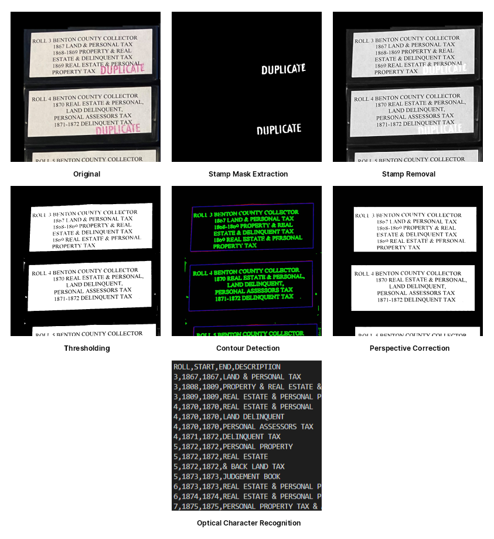
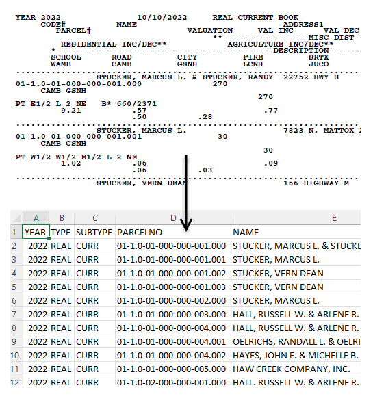

# Benton County Missouri Collector of Revenue

This repository contains code and data created for use in the Office of the
Collector of Revenue in Benton County Missouri.

## Projects

### [Microfilm Label Reader](scripts/microfilm2csv.py)

This is a Python script created to generate an inventory of microfilm from
photos of multiple containers. It utilitizes OpenCV to detect and isolate
the label from each container, then performs OCR with Tesseract to generate
a CSV listing of record series on each roll.

Run it with one of the sample images:

    python3 scripts/microfilm2csv.py testdata/microfilm/1.jpg

You can also pass the `-d` flag to get images of each preprocessing step and
the raw OCR results from Tesseract.

### [Tax Book PDF to CSV Converter](scripts/book2csv.py)

A Python script that uses MuPDF to read our PDF tax books and convert them to
CSV format.

Run it with one of the sample PDF files:

    python3 scripts/book2csv.py testdata/books/real_current.pdf

### [Tax Statement Preprocessor](scripts/statements2pdf.py)

This is a Python script that preprocesses tax statements generated by our tax
collection system using GhostScript and MuPDF. It currently:

1. Converts the PostScript output to PDF
2. Crops pages from A4 to US Letter
3. Reverses the print order of the pages so that they are in the correct order
   after going through the automatic folding machine
4. Splits pages into batches
5. Adds sequencing information to the corner of each page
6. Detects statements with prior years due and adds an above-the-fold indicator
   that tells employees to insert a letter with the statement

Run it with one of the sample files:

    python3 scripts/statements2pdf.py testdata/statements/current.prn

## License

This software is the work of a government agency in the United States. To the
extent possible under law, the author(s) have dedicated all copyright and
related and neighboring rights to this software to the public domain worldwide.
This software is distributed without any warranty.

You should have received a copy of the CC0 Public Domain Dedication along with
this software. If not, see <http://creativecommons.org/publicdomain/zero/1.0/>.

## Privacy

A subset of local property tax data, including names and addresses of taxpayers,
is provided for testing purposes. This data is public information and available
from a variety of other sources.
